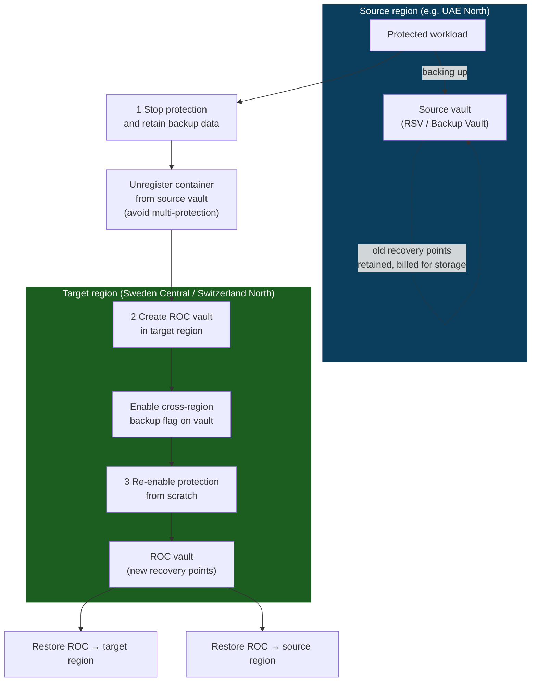

# MECRBROCTooling

Tooling for **Azure Cross-Region Backup to a non-paired region — "Region of Choice" (ROC)**.

Because some Azure regions have no native paired region, Azure Backup's ROC capability lets you keep backed-up data in an alternate Azure region of your choice (outside the source region) and re-establish backups there for off-site data protection.

> ⚠️ **Access is restricted.** These scripts are intended **only for customers who are whitelisted** for this feature (originally the UAE / Qatar Middle East scenario) with a previously agreed target region. They will not work outside of that onboarded scope.

---

## What is Region of Choice (ROC)?

ROC keeps your backup data in a target region you choose, rather than in an automatically-assigned Azure-paired region. Implementing ROC for an existing (brownfield) workload follows three steps:

1. **Stop-and-retain in the source region** — Choose *"Stop Protection and retain backup data"*. No new scheduled backups run, but all existing recovery points are preserved.
2. **Create a new vault in the target region** — A Recovery Services Vault (RSV) or Backup Vault (DPP) in a region that meets the customer's risk and compliance requirements.
3. **Re-enable protection from scratch** in the new ROC vault, without losing the old backup data in the source vault.

### ROC migration flow



> Recovery points already in the source vault are **not migrated** — they stay behind (and continue to incur storage cost) while new backups accumulate in the ROC vault. See the [FAQ](#faq) on brownfield migration.

### Target regions

Region onboarding is enabled for all workloads in **Switzerland, Sweden, and Italy** — no separate subscription onboarding is required. For Middle East customers:

| Priority | Region |
|----------|--------|
| Preferred | **Sweden Central** |
| 2nd priority | **Switzerland North** |

> For Confidential VMs, note that **Sweden Central runs hot on capacity**. CVM is GA in **Switzerland North** and is in a better state with respect to capacity.

---

## ⚠️ Critical operating rules

- **Scripts only.** All backup and restore operations must be performed via the scripts in this repo. The Azure Portal experience does **not** work for ROC — **except for Blobs and ADLS** (see [Blobs & ADLS](#blobs--adls-rest-api)).
- **AKS:** The script only enables cross-region backup settings on vaults that are **newly created by the script**. Existing vaults are not retrofitted.
- **Azure Files (AFS):** Protect using the **`Vault-Standard`** policy only. Start with **5 file shares at a time** — only trigger the next batch once the current one succeeds.
- **No multi-protection.** A workload must not be backed up to both the source and target vaults at once. Stop-protection-with-retain and unregister the container from the source vault **before** registering it with the new ROC vault.
- **Vault-level flag.** Every DPP Backup Vault must have the cross-region backup property enabled at the vault level (at create time or via an update call) before configuring protection.

---

## Support matrix

| Workload | Snapshot tier backup | Vault tier (ROC) backup | Source→Source restore | ROC→Source restore | ROC→ROC restore |
|----------|:---:|:---:|:---:|:---:|:---:|
| Blob | Yes | Yes | Yes | Yes | Yes |
| ADLS | No | Yes | No | Yes | Yes |
| Azure Files *(max 10 TB / 10M files)* | Yes | Yes | Yes | Yes | Yes |
| IaaS VM: General purpose | Yes | Yes | Yes | Yes | Yes |
| IaaS VM: Confidential + PMK | Yes | Yes | Yes | Yes | Yes |
| IaaS VM: Confidential + CMK (mHSM) | Yes | Yes | Yes | Yes | Yes |
| IaaS VM: Confidential + CMK (AKV) | Yes | Yes | Yes | Yes | Yes, **with workaround** — migrate CVM from AKV to mHSM |
| AKS *(max 100 nodes, 1 TB disks)* | Yes | Yes | Yes | Yes | Yes |
| PostgreSQL Flexible Server *(≤ 1 TB)* | No | Yes | No | Yes | Yes |
| SQL in VM | Yes *(Private Preview)* | Yes | Yes | Yes | Yes |
| SAP HANA in VM | Yes | Yes | Yes | Yes | Yes |

**Not supported:** ADE (Azure Disk Encryption) VMs, and 2 Blob Confidential VMs (Azure Backup and CRP do not support this).

---

## Prerequisites

- **Azure PowerShell** (`Connect-AzAccount`) — Az modules including `Az.Accounts`, `Az.Resources`, `Az.Compute`, `Az.Network`, `Az.RecoveryServices`, `Az.Automation`, `Az.ResourceGraph` — **or** **Azure CLI** (`az login`). Most REST-based scripts accept either.
- For DPP/AKS/PGFlex CLI workflows: the `dataprotection` and `k8s-extension` az CLI extensions (auto-installed by the scripts when missing).
- Appropriate **RBAC** on both the source workload/vault and the target vault — typically Contributor, or Owner / Contributor + User Access Administrator for AKS (which assigns roles to MSI identities).
- The **target vault's resource group must already exist** before running the configuration scripts.

---

## Repository layout

The repo is organized by the Azure Backup model each workload uses: **ASR** (replication), **DPP** (Backup Vault) and **RSV** (Recovery Services Vault).

### `ASR/` — Azure Site Recovery (disaster-recovery replication)

For workloads where the goal is DR replication rather than backup retention.

| Script | Purpose |
|--------|---------|
| `Enable-ASRReplication.ps1` | Enables Azure-to-Azure (A2A) replication for one or more VMs via the *Create Protection Intent* REST API. Flexible VM selection (RG / location / VM ID / CSV), auto-creates or reuses the vault, replication policy, automation account and target VNet, fire-all-then-poll job tracking, optional initial-replication monitoring, and CSV export of results. |

### `DPP/` — Backup Vault / Data Protection Platform

Newer backup workflows built on the `Microsoft.DataProtection` provider (REST API version `2025-08-15-preview` for ROC). Shared scripts at the folder root:

| Script | Purpose |
|--------|---------|
| `update-backupvault-crb.ps1` | Enables the cross-region-backup (`regionOfChoiceSettings`) flag on an existing Backup Vault. |
| `dpp_stop_protection_retain_data.ps1` | Stops protection while retaining data forever, via `az dataprotection backup-instance stop-protection`, then polls until stopped. |

#### `DPP/AKS/` — Azure Kubernetes Service

- `Configure Backup/configure-backup-aks.ps1` (+ `.md`) — end-to-end configure: create a Backup Vault with cross-region backup, create a **VaultStore** policy, install the backup extension, assign MSI roles, and configure the backup instance. `--datasource-location` must be the **cluster** location, not the vault.
- `Restore/aks-restore-vault-tier.ps1` (+ `.md`) — restore from the vault tier. For a cross-region restore, set `--restore-location` to the target cluster location and **do not** pass `--use-secondary-region`.
- `update-backupvault-crb.ps1`, `dpp_stop_protection_retain_data.ps1` — AKS copies of the shared DPP scripts.
- `OLD/` — earlier E2E variants kept for reference.

#### `DPP/PGFlex/` — PostgreSQL Flexible Server

| Script | Purpose |
|--------|---------|
| `configure-protection-pgflexbi-crb.ps1` | Configure protection (PUT backup instance) with cross-region backup. |
| `restore-pgflexbi-crb 1.ps1` | Restore a PostgreSQL Flexible Server backup. |
| `update-backupvault-crb.ps1` | Enable the cross-region-backup flag on the vault. |
| `dpp_stop_protection_retain_data.ps1` | Stop protection while retaining data. |

### `RSV/` — Recovery Services Vault

Classic backup model on the `Microsoft.RecoveryServices` provider. Most scripts are REST-based, support cross-subscription scenarios, and ship with a matching `*-Readme.txt`/`.md`.

#### `RSV/AFS/` — Azure Files

Protect with the **`Vault-Standard`** policy, in batches of **5 shares**.

| Script | Purpose |
|--------|---------|
| `Register-StorageAccount-ToVault.ps1` / `Unregister-StorageAccount-FromVault.ps1` | Register / unregister a storage account to/from a vault. |
| `Configure-FileShare-Protection.ps1` / `Stop-FileShare-Protection.ps1` | Configure / stop protection for a single file share. |
| `Bulk-Configure-FileShare-Protection.ps1` / `Bulk-Stop-FileShare-Protection.ps1` | CSV-driven bulk configure / stop (see the `*_Input.csv` templates). |
| `Restore-AzureFileShare-RestAPI.ps1` | Restore an Azure file share. |

#### `RSV/IaaSVM/` — Azure IaaS VMs

**`GPVM/` — General-purpose VMs**

| Script | Purpose |
|--------|---------|
| `Register-IaaSVM-ToVault.ps1` | Enable backup protection for a VM (lists policies, verifies status). |
| `Stop-IaaSVM-Protection.ps1` | Stop protection for a VM. |
| `Restore-IaaSVM-RestAPI.ps1` | Restore a VM. |
| `Bulk-Register-IaaSVM-FromCSV.ps1` / `Bulk-Stop-IaaSVM-Protection-FromCSV.ps1` | CSV-driven bulk register / stop (see the `SampleInput-*.csv` templates). |

**`CVM/` — Confidential / encrypted VMs**

| Script | Purpose |
|--------|---------|
| `Restore-IaaSVM-CVM-RestAPI.ps1` | REST-based restore for Confidential VMs. |
| `Restore-CvmEncryptionKey.ps1` | Restore the CMK encryption key material into a target mHSM/AKV. |

See [Confidential VM + CMK restore](#confidential-vm--cmk-restore) for the two-pass restore flow.

#### `RSV/SAPHana/` — SAP HANA in VM

| Script | Purpose |
|--------|---------|
| `Register-SAPHanaVM-ToVault.ps1` | Discover, register and protect HANA databases (Scale-up single-container and Scale-out/MDC). |
| `Restore-SAPHana-AlternateVM.ps1` | Restore HANA to an alternate VM. |
| `Unregister-SAPHanaVM-FromVault.ps1` | Unregister a HANA VM from a vault. |

Requires the SAP HANA backup pre-registration script to have been run on the VM.

#### `RSV/SQL/` — SQL Server in VM

Handles the extra complexity of moving SQL protection between vaults, including Always On Availability Groups. See [`RSV/SQL/README.md`](RSV/SQL/README.md) for the full migration flow.

| Script | Purpose |
|--------|---------|
| `Register-SQLIaaSVM-ToVault.ps1` / `Unregister-SQLIaaSVM-FromVault.ps1` | Register / unregister a single standalone SQL VM. |
| `Bulk-RegisterSQLIaaSVM-ToVault.ps1` / `Bulk-UnregisterSQLIaaSVM-FromVault.ps1` | CSV-driven bulk register / unregister. |
| `Bulk-UnregisterSQLAG-FromVault.ps1` | Unregister VMs with AG databases (stop-with-delete + soft-delete). |
| `Bulk-UndeleteSQLItems-FromVault.ps1` | Undelete soft-deleted backup items (recover AG recovery points during vault migration). |
| `Enable-AGAutoProtection.ps1` | Enable auto-protection on SQL Availability Groups. |
| `Restore-SQLIaaSVM-FromVault.ps1` | Restore a SQL database (ALR / RestoreAsFiles). |

---

## Blobs & ADLS (REST API)

Blobs and ADLS are the exception to the "scripts only" rule — they are configured directly via REST API (or the experimental portal), not the scripts in this repo:

1. **Create Vault** with preview API version `2025-08-15-preview` and enable the vault ROC setting.
2. **Create Policy** using the standard documented steps.
3. **Configure protection** using the standard onboarding.

**Key requirement:** For every operation whose request contains `dataSourceInfo` / `dataSourceSetInfo` (configure, update, restore), the `resourceLocation` field **must match the storage account location** — not the vault location.

Enabling ROC at the vault level (`regionOfChoiceSettings.status = "Enabled"`):

```http
PUT https://management.azure.com/subscriptions/{subscriptionId}/resourceGroups/{resourceGroupName}/providers/Microsoft.DataProtection/backupVaults/{vaultName}?api-version=2025-08-15-preview
```
```json
{
  "location": "eastus2euap",
  "identity": { "type": "SystemAssigned" },
  "properties": {
    "storageSettings": [ { "datastoreType": "VaultStore", "type": "LocallyRedundant" } ],
    "securitySettings": { "softDeleteSettings": { "state": "Off" } },
    "regionOfChoiceSettings": { "status": "Enabled" }
  }
}
```

References: [Azure Backup REST API](https://learn.microsoft.com/en-us/rest/api/dataprotection/) · [Create/Update Backup Vault](https://learn.microsoft.com/en-us/rest/api/dataprotection/backup-vaults/create-or-update) · [Backup Instances](https://learn.microsoft.com/en-us/rest/api/dataprotection/backup-instances)

---

## Confidential VM + CMK restore

CVM backup is in Preview in UAE North and Korea Central. For ROC:

- **CVM + PMK** and **CVM + CMK in mHSM** — fully supported for backup and restore.
- **CVM + CMK in AKV** — cross-region restore is **not** possible directly. Migrate the key from AKV to **mHSM** to unblock. It is recommended to use PMK or mHSM-based CVMs.
- Ensure CVM is GA (or you are enrolled in the preview) in the **target restore region**.

**Two-pass CMK restore** (see [`RSV/IaaSVM/CVM/CVM+CMK Restore.docx`](RSV/IaaSVM/CVM/CVM+CMK%20Restore.docx) for full detail):

1. **1st restore** with `Restore-IaaSVM-CVM-RestAPI.ps1`, providing a **CVM DES ID** of type *"Confidential disk encryption with CMK"*. This restore is **expected to fail** (e.g. `UserErrorInputDESKeyDoesNotMatchWithOriginalKey`) but it restores the backup key material to the target storage account. Note the *Target Storage Account*, *Config Blob Container* and *Secured Encryption Info Blob* from the restore job.
2. **Restore the key** into a target mHSM/AKV (same security domain / geographical boundary as the source) with `Restore-CvmEncryptionKey.ps1`.
3. **Create a new DES** pointing to the restored key, and assign the required roles (DES, *Backup Management Service*, *Confidential VM Orchestrator*) on the mHSM/AKV.
4. **2nd restore** with `Restore-IaaSVM-CVM-RestAPI.ps1`, passing the new DES ID.

For same-region restore where the original keys/AKV/mHSM still exist, run `Restore-IaaSVM-CVM-RestAPI.ps1` **without** a CVM DES ID.

---

## Cost considerations

- Protecting data in the new ROC vault incurs additional **network egress charges** and a **marked-up Protected Instance fee**.
- The source vault's stop-and-retain data continues to incur **storage costs**.
- See [Azure Backup pricing](https://azure.microsoft.com/pricing/details/backup/).

---

## FAQ

**Is ROC available for all Azure Backup workloads?**
It is supported for workloads that already support vault-tier backups and are in-market: IaaS VM (GP), SQL in VM, SAP HANA in VM, CVM, Files, Blobs, ADLS, AKS, and PostgreSQL Flexible Server. **ADE VMs are not supported.** (AKS: max 100 nodes / 1 TB disks; PgSQL: ≤ 1 TB.)

**Can I restore from the source-region snapshot tier if the ROC vault is down?**
No. If the ROC vault region is unavailable, neither backup nor restore works — including from the operational (snapshot) tier — unless the workload has its own independent native restore mechanism.

**Is multi-protection (same workload in two regions) supported?**
No. Stop-protection-with-retain and unregister from the source vault before registering with the ROC vault.

**Can I migrate existing ("brownfield") backups into a ROC vault?**
Not the recovery points themselves. Stop-and-retain in the source, create the ROC vault, and re-enable protection from scratch. A future GA release is expected to add one-time migration of recovery points between vaults; today, remote backups may need to remain in the target region.

**Which copy is fastest for recovery?**
The **local snapshot copy** in the source region — the data is already in the customer tenant, so restores start immediately. Vaulted restores must copy data from the Microsoft-managed vault tenant and are slower.

---

## At a glance

- **`ASR/`** — disaster-recovery replication (A2A).
- **`DPP/`** — Backup Vault / Data Protection workloads (AKS, PostgreSQL Flexible Server).
- **`RSV/`** — Recovery Services Vault workloads (Azure Files, IaaS VMs incl. Confidential VMs, SAP HANA, SQL).
